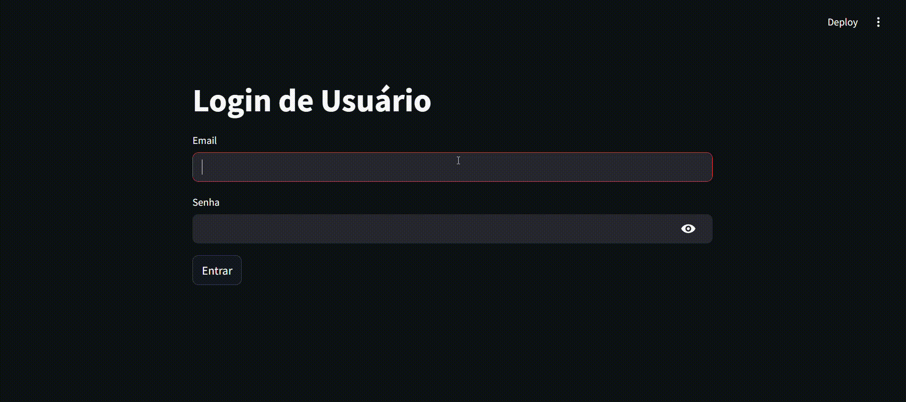
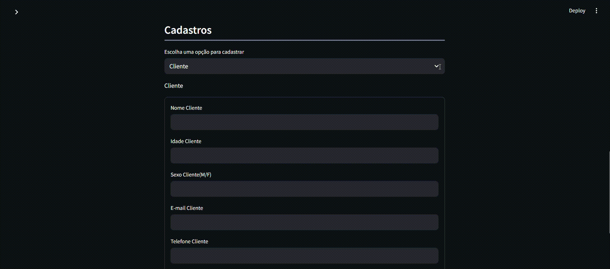
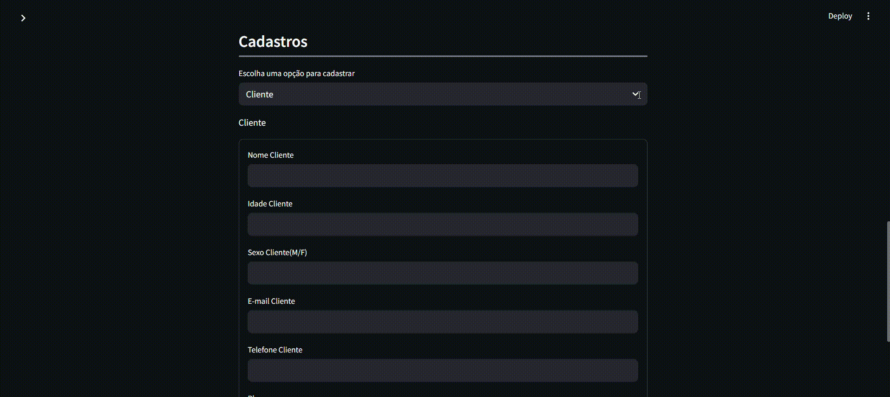
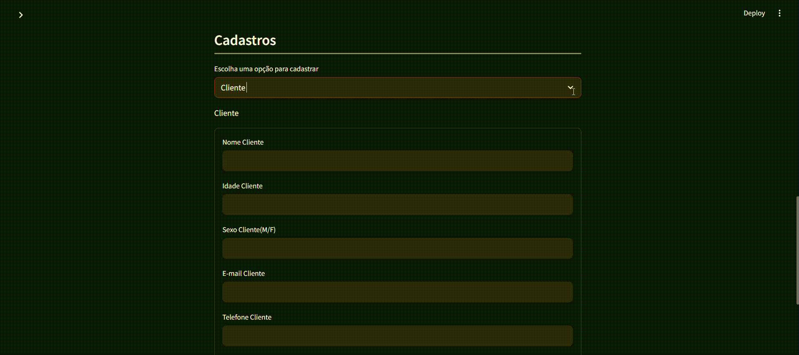

<h1>Sistema de Academia</h1>

A principal proposta foi transformar informações que normalmente ficam em planilhas ou papéis (dados de clientes/alunos, treinos, pagamentos, etc.) em uma aplicação funcional, fácil de usar e que centralize tudo em um só lugar. O projeto possui por finalidade praticar os ensinamentos aprendidos ao decorrer da capacitação em Analytics.

<h2>Tecnologias utilizadas</h2>
<ul>
    <li><strong>Python v3.13.3</strong></li>
    <li><strong>Datetime v3.13.3</strong>: Usado para registrar e formatar datas e horários.</li>
    <li><strong>SQLite v3.49.1</strong>: Gerencia banco de dados SQLite. Usado para criar tabelas, inserir e consultar dados da academia.</li>
    <li><strong>Pandas v2.2.3</strong>: Manipula dados em tabelas (DataFrames). Usado para ler arquivos CSV e executar consultas SQL com retorno estruturado.</li>
    <li><strong>Streamlit v1.45.1</strong>: Cria dashboards interativos com interface web. Usado para exibição de dados e controle de sessão do usuário.</li>
    <li><strong>Hashlib v3.13.3</strong>: Gera hash seguro de senhas com SHA-256. Usado para proteger credenciais de login no banco de dados.</li>
</ul>

<h2>Estrutura das pastas</h2>

<pre>
GYM-SYSTEM/
├── __pycache__/
├── csv/                          # Dados fictícios para alimentar SQL
│   ├── clientes_academia.csv
│   ├── exercicios.csv
│   ├── instrutores.csv
│   ├── pagamento_clientes.csv
│   ├── planos.csv
│   ├── treino_exercicios.csv
│   └── treinos.csv
├── database/
│   └── gym-system.db             # Banco de dados SQLite
├── modules/                      # Modularização dos scripts do projeto
│   ├── __pycache__/
│   ├── auth.py
│   ├── database.py
│   ├── forms.py
│   └── queries.py
└── main_app.py                   # Script principal do projeto

</pre>

Outros arquivos e pastas foram omitidos por não serem essenciais para o entendimento da estrutura do projeto.

<h2>Funcionalidades</h2>

<h3 id="login-logout">Login e Logout de Usuários</h3>

<ul>
  <li>O sistema exibe uma interface que apresenta dois campos obrigatórios: <code>E-mail</code> e <code>Senha</code> (com ícone para mostrar/ocultar senha).</li>
  <li>O botão <code>Entrar</code> verifica as credenciais antes de liberar acesso.</li>
  <li>Sem login, não é possível acessar nenhuma funcionalidade interna.</li>
  <li>Botão <code>Sair</code> permite fazer <code>Logout</code>, encerrando a sessão.</li>
</ul>

 

<h3>Exibir DataFrame Filtrado</h3>

<ol>
  <li><strong>Listagem dos Clientes e seus Planos</strong>: exibe um DataFrame por <code>Clientes</code> e seus <code>Planos</code>.</li>
  <li><strong>Listagem dos Treinos e seus Exercícios</strong>: exibe um DataFrame por <code>Treino</code> e seus <code>Exercícios</code>.</li>
  <li><strong>Listagem dos Pagamentos por Cliente</strong>: exibe a quantidade de pagamentos realizados por clientes e seu último pagamento.</li>
  <li><strong>Listagem dos Clientes por Instrutor</strong>: exibe um DataFrame que relaciona quantos clientes cada instrutor possui.</li>
</ol>

 

<h3>Cadastro de Clientes</h3>

<ul>
  <li><strong>Interface</strong>: A interface apresenta campos obrigatórios, como: Nome do Cliente, Idade do Cliente, Sexo do Cliente, E-mail do Cliente, Telefone do Cliente e Plano do Cliente.</li>
  <li>O sistema valida se os campos foram preenchidos e valida se o cliente já possui cadastro, caso verdadeiro, um alerta é exibido ao usuário.</li>
</ul>

 

<h3>Cadastro de Pagamentos</h3>

<ul>
  <li><strong>Interface</strong>: A interface apresenta o campo obrigatório: Nome de Cliente (dropdown).</li>
  <li>Ao clicar em <code>Pago</code>, é salvo no banco de dados um novo pagamento do cliente selecionado.</li>
</ul>

 

<h3>Cadastro de Treinos</h3>

<ul>
  <li><strong>Interface</strong>: A interface apresenta os campos obrigatórios: Nome do cliente (dropdown), nome do instrutor (dropdown), data de início, data de término e plano.</li>
  <li>Ao clicar em <code>Cadastrar</code>, novo treino é vinculado ao cliente e instrutor existente.</li>
</ul>

 

<h3>Cadastro de Exercícios por Treino</h3>

<ul>
  <li><strong>Interface</strong>: A interface apresenta dropdowns com opções de <code>Treino</code> e <code>Exercício</code>.</li>
  <li>Define <code>Treino</code>, <code>Exercício</code> e quantidade de <code>Séries</code> e <code>Repetições</code>.</li>
  <li>Botão <code>Salvar</code> cria a associação no banco para montar a ficha de treino.</li>
</ul>

 

<h3>Visualização do Banco de Dados (SQLite)</h3>

<ul>
  <li>Após clicar nos botões de submissão, o banco de dados é alterado conforme pode-se notar na imagem animada acima.</li>
</ul>

<h2>Como rodar esse projeto em seu ambiente</h2>

<h3>Pré-requisitos:</h3>
<ul>
  <li>Python v3.13.3 ou superior</li>
  <li>Git instalado</li>
  <li>Navegador moderno (Chrome, Firefox, etc.)</li>
</ul>

<h3>Passo a passo:</h3>
<ol>

  <li>
    <strong>Instale o Git (caso não possuir)</strong> 
    Acesse: <a href="https://git-scm.com/downloads" target="_blank">git-scm.com/downloads</a> 
    Baixe e instale conforme seu sistema operacional. 
    Verifique a instalação com:
    <pre><code>git --version</code></pre>
  </li>

  <li>
    <strong>Clone o repositório do projeto</strong>
    <pre><code>git clone https://https://github.com/HeitorDalla/gym-system.git
cd seu-repositorio</code></pre>
  </li>

  <li>
    <strong>Instale as dependências do projeto</strong> 
    <pre><code>pip install streamlit pandas</code></pre>
  </li>

  <li>
    <strong>Execute a aplicação com Streamlit</strong>
    <pre><code>streamlit run main_app.py</code></pre>
    (Substitua <code>main_app.py</code> pelo nome do seu arquivo principal se for diferente.)
  </li>

  <li>
    <strong>Acesse no navegador</strong> 
    Streamlit abrirá automaticamente. Caso contrário, acesse:
    <pre><code>http://localhost:8501</code></pre>
  </li>

</ol>

<h2>⚠️ Importante</h2>

Todos os dados utilizados neste projeto são estritamente fictícios/simulados e não se baseiam em informações reais ou sensíveis. Não há nenhum conteúdo restrito ou confidencial, tampouco dados ofensivos que possam ferir a privacidade, integridade ou reputação de indivíduos ou organizações. Dessa forma, assegura-se que tais dados não representem qualquer perigo ou risco, seja à segurança física ou digital de qualquer pessoa.

<h2>Contribuições</h2>

Este projeto está aberto para contribuições via issues. Se você encontrou um bug, deseja sugerir uma melhoria ou tem dúvidas sobre o funcionamento, siga as instruções abaixo:

<ol>
    <li>Verifique se já existe uma issue sobre o assunto. Caso sim, adicione um comentário nela.</li>
    <li>Se não houver, abra uma nova issue com uma descrição clara e objetiva.</li>
</ol>

<h2>Licença e Autor</h2>

Este projeto foi desenvolvido por <a href="https://github.com/HeitorDalla">Heitor Giussani Dalla Villa</a>, <a href="https://github.com/MatheusVenturaNellessen">Matheus Ventura Nellessen</a> e <a href="https://github.com/WillZanutto">Willian Zanutto</a>, e está licenciado sob a licença MIT. Veja o <a href="./LICENSE">documento</a> para mais detalhes.

